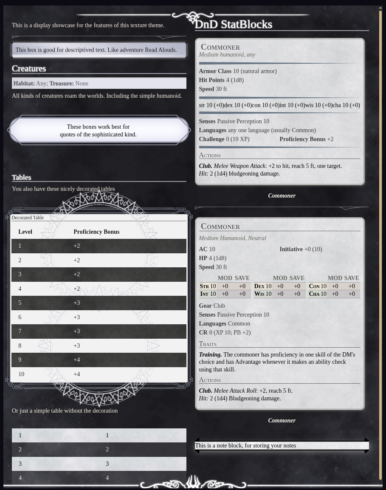
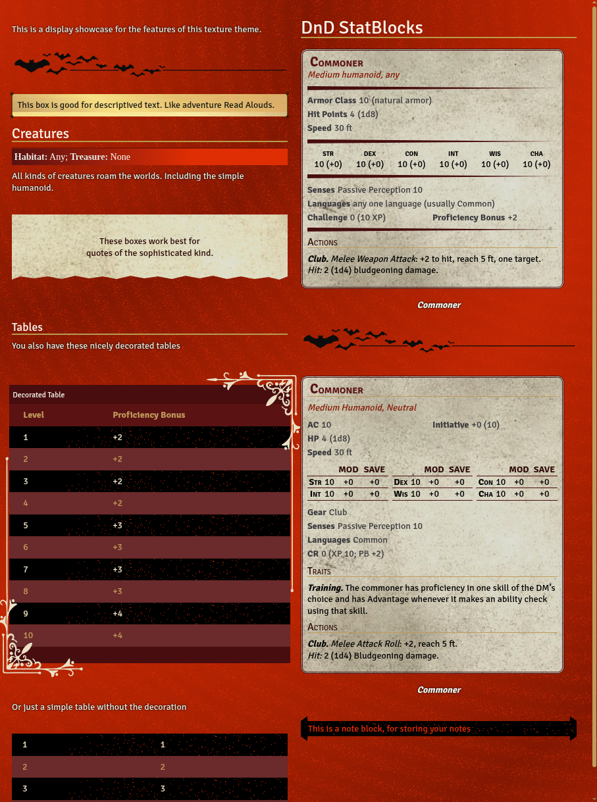

# Journal Themes!

Many of us love our journals but wish to customize them in new ways.
So I have decided to take the themes that help inspire me and share them with others.

Each of these themes can be selected per journal using the "Sheet Configuration" menu.

## Hollow Knight

The first theme added to this pack was designed by CamunonZ over on [Homebrewery](https://homebrewery.naturalcrit.com/share/aEktI6B6RtzB) and rebuilt in foundry with their approval. I suggest you go give the original a look and give CamunonZ your support!

I have rebuilt the style template as a Foundry Journal, including the DnD 5e and 5.5e statblock reskins.

## Vampire
In celebration of October the second theme added to this pack is as red as the blood of our enemies!

